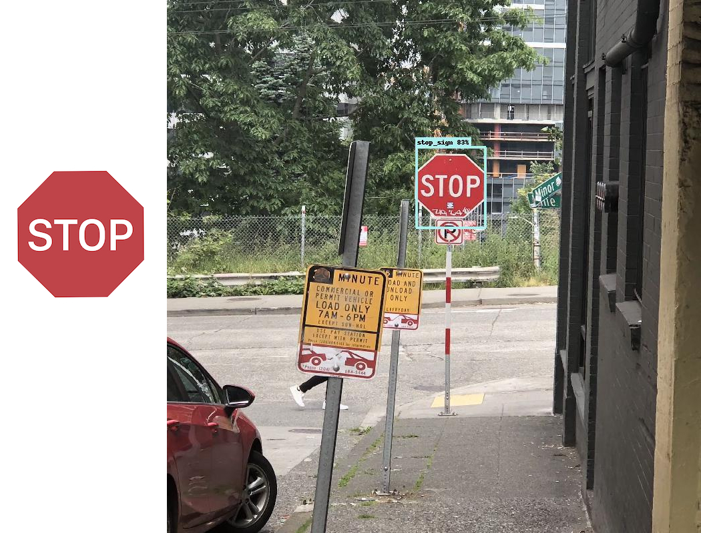
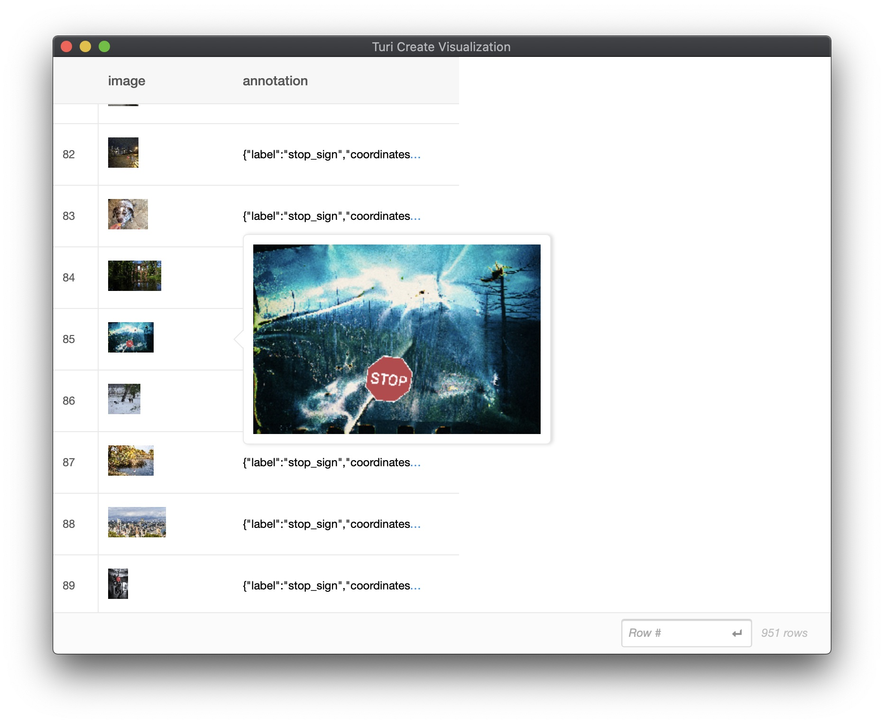
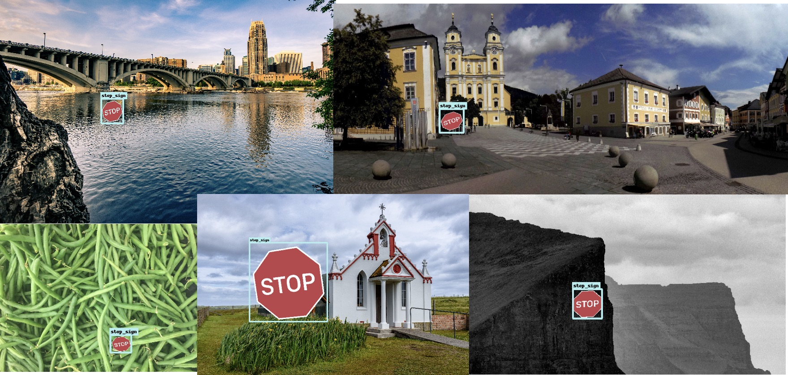

# One-Shot Object Detection

One-Shot object detection (OSOD) is the task of detecting an object from as few as **one** example per category. Unlike the [Object Detector](https://apple.github.io/turicreate/docs/userguide/object_detection) which requires many varied examples of objects in the real world, the One-Shot detector only requires a single canonical example of an object to train the classifier on and perform predictions for that category in the wild. It is best suited for 2D objects or when there isn't much expected variance in the examples, such as playing cards, logos, road signs, and clapperboards. One-Shot detector is not suitable for 3D objects such as faces, animals, and cars which is a task better suited for the regular [Object Detector](https://apple.github.io/turicreate/docs/userguide/object_detection). 


## Introductory Example

In this example, our goal is to **localize** instances of **stop signs** in images. To train a model for this application, we supply a single image of a stop sign as a starter image.

Given a starter image (*left*), a one-shot detector trained on this starter image will produce instance predictions on a test image (*right*) which may look like this:

 


```python
import turicreate as tc

# Load the starter images
starter_images = tc.SFrame({'image':[tc.Image('stop_sign.png')],
                   'label':['stop_sign']})

# Load test images
test_data = tc.SFrame({'image':[tc.Image('stop_sign_photo1.png'), 
                                tc.Image('stop_sign_photo2.png')],
                        'label':['stop_sign', 'stop_sign']})

# Create a model. This step may take several hours                                      
model = tc.one_shot_object_detector.create(starter_images, 'label')

# Save predictions on the test set
test_data['predictions'] = model.predict(test_data)

# Draw prediction bounding boxes on the test images
test_data['image_with_predictions'] = \
	tc.one_shot_object_detector.util.draw_bounding_boxes(test_data['image'], test_data['predictions']) 

# To visualize the predictions made on the test set
test_data.explore()

# Save the model for later use in TuriCreate
model.save('mymodel.model')

# Export for use in Core ML
model.export_coreml('MyCustomOneShotDetector.mlmodel')
```


Examples of test image predictions:


## Deployment to CoreML

To learn more about deploying One-Shot to CoreML details, refer to the [Object Detector: Deployment to Core ML](https://apple.github.io/turicreate/docs/userguide/object_detection/export-coreml.html) chapter.


## How it works

In this section, we will go into detail on what happens under the hood of the `create` method. An OSOD model is trained in two steps: First, we use the starter images to generate synthetic data and annotations, and second, we train an object detector.

**Stage 1: Automatic synthetic data generation**

To begin training, a set of synthetic training data needs to be generated using the provided starter image(s). 
The synthetic images are generated by applying yaw, pitch, and roll rotations on a set of background images. If no background images are provided, a set of default background images are automatically downloaded and used.

**Stage 2: Train the Object Detector model**

To learn about the training implementation details, refer to the [Object Detector: How it Works](https://apple.github.io/turicreate/docs/userguide/object_detection/how-it-works.html) chapter.


## Advanced Usage

### Background Images

You can preview the synthetic images the toolkit generates by calling the `preview_synthetic_training_data` utility. This helps you understand data the model would be trained on:  


```python
synthetic_images = \
tc.one_shot_object_detector.util.preview_synthetic_training_data(starter_images, 'label')

synthetic_images.explore()
```



Some examples of synthetic training data:




*Note: In order to view the exact synthetic images used to train the model, the same seed should be used which was used to train the model.*

While we provide a set of background images by default, you can use your own custom background images (specific to your application) as follows:    

```python
# Load background images
my_backgrounds = tc.SArray('my_custom_backgrounds.sarray')

# Create a model using custom background images                                    
model = tc.one_shot_object_detector.create(starter_images, 'label', backgrounds=my_backgrounds)
```

To preview the synthetic images generated with your custom background images:

```python
synthetic_images = \
tc.one_shot_object_detector.util.preview_synthetic_training_data(starter_images, 'label', my_backgrounds)
```
